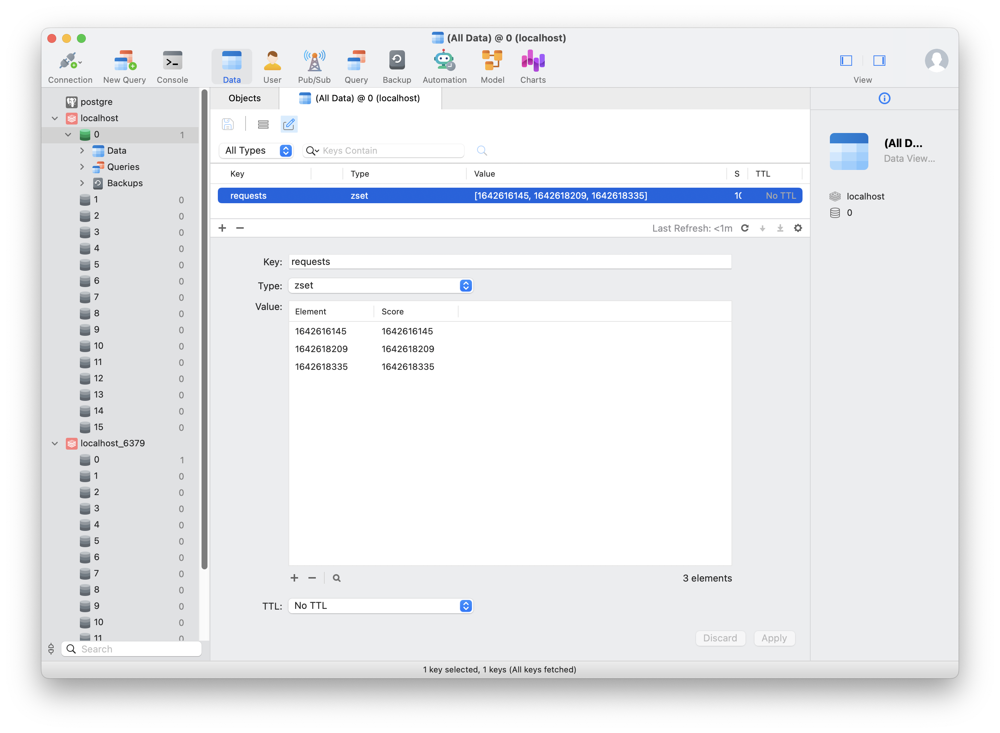

# Rate Limit Core Function Explanation

## 1: Coding

### How it works:

The rate limit core function aims to restrict the number of requests a client can make within a specific time frame without using Redis. Here's how it works:

1. The function is initialized with the rate limit (R), which specifies the maximum number of requests allowed per hour.
2. For each incoming request, the function checks the timestamp of the request and compares it with the timestamps of previous requests.
3. It maintains a list of recent request timestamps in memory.
4. If the number of requests made within the last hour exceeds the rate limit (R), the function rejects the incoming request.
5. Otherwise, the function accepts the request and updates the list of recent request timestamps.

## 2: Design

### How it works:

To scale the API gateway and handle rate limiting efficiently, i using Redis as a caching solution. Here's how it works with Redis:

1. A Redis Sorted Set named "requests" is used to store the timestamps of recent requests.
2. Each incoming request adds its timestamp to the "requests" Sorted Set.
3. Before processing a new request, the function removes all timestamps from the Sorted Set that are older than 1 hour from the current timestamp.
4. The function then checks the number of remaining timestamps in the Sorted Set.
5. If the count exceeds the rate limit (R), the request is rejected; otherwise, it is accepted, and the timestamp is added to the Sorted Set.
6. By using Redis, the rate limiting function can efficiently handle a large number of requests and scale across multiple instances of the API gateway.

